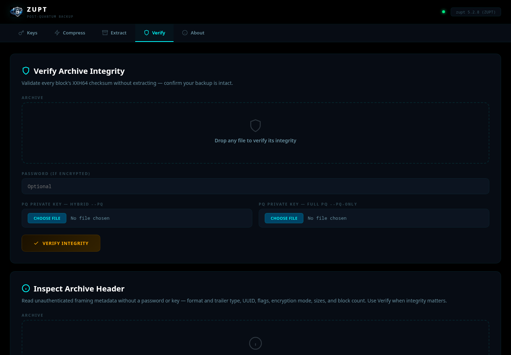

# Zupt Web — Post-Quantum Backup in Your Browser

**Encrypt, compress, and protect files with quantum-resistant cryptography — from any browser.**

One-command deploy. No accounts. No cloud. Your keys, your data, your server.

```bash
docker compose up -d
# → http://localhost:8181
```
---

## Features

| Feature | Description |
|---------|-------------|
| **Key Generation** | ML-KEM-768 + X25519 hybrid keypairs — download private and public keys |
| **Compress & Encrypt** | Upload files → compressed `.zupt` archive. Password, PQ, or both |
| **Extract & Decrypt** | Upload `.zupt` archive + key/password → original files returned |
| **Integrity Verify** | Validate every block's XXH64 checksum without extracting |
| **Codec Selection** | AUTO (hardware-adaptive), VaptVupt (AVX2/NEON), LZHP, Store |
| **Block Dedup** | Eliminates duplicate blocks before compression (since zupt v2.1.5) |
| **Levels 1–9** | Fastest to maximum compression ratio |

## Security

- **Zero JavaScript frameworks** — minimal vanilla JS for tab switching and drag-drop only
- **CSRF tokens** on every form (double-submit cookie, `hmac.compare_digest`)
- **Rate limiting** — 10 keygen/min, 30 operations/min per IP
- **Content-Security-Policy** via Nginx — `script-src 'self'; frame-ancestors 'none'`
- **No `shell=True`** — all subprocess calls use explicit argv
- **Path traversal protection** — filenames sanitized, paths verified with `.relative_to()`
- **Keys auto-expire** from server after 4 hours
- **Nginx hardened** — `server_tokens off`, `X-Frame-Options DENY`

## Screenshots
<p align="center">
  <br><br>
  <br><br>
  <br><br>
  <br><br>
  
</p>

## Comparison

| | **Zupt Web** | age + gzip | GPG + tar | Duplicati | BorgBackup |
|---|---|---|---|---|---|
| Post-quantum encryption | ML-KEM-768 + X25519 | — | — | — | — |
| Block-level dedup | XXH64 fingerprint index | — | — | — | HMAC |
| Web interface | Self-hosted Docker | CLI | CLI | Web | CLI |
| Zero dependencies | Pure C11 | Go | GnuPG | .NET | Python |
| Hardware-adaptive codec | AVX2/NEON auto | — | — | — | — |
| Per-block integrity | XXH64 per block | — | Whole-file | — | HMAC |
| Docker one-command | `docker compose up -d` | — | — | Yes | — |

## Cryptographic Stack

| Algorithm | Standard | Purpose |
|-----------|----------|---------|
| ML-KEM-768 | FIPS 203 | Post-quantum key encapsulation |
| X25519 | RFC 7748 | Elliptic curve Diffie-Hellman |
| AES-256-CTR | FIPS 197 | Symmetric encryption |
| HMAC-SHA256 | RFC 2104 | Message authentication |
| PBKDF2-SHA256 | RFC 8018 | Password key derivation (600K iterations) |
| SHA3/SHAKE | FIPS 202 | Hybrid key derivation |

## Deploy

### Prerequisites

- Docker and Docker Compose

### Quick Start

```bash
git clone https://github.com/cristiancmoises/zupt-web && cd zupt-web
docker compose up -d
```

Open **http://localhost:8181**

### Increase/Decrease 
```bash
# Example for decrease to 50MB
# Edit app.py
app.config['MAX_CONTENT_LENGTH'] = 50 * 1024 * 1024   # 50 MB
```
```bash
# Example for decrease to 50MB
# Edit app.py                                   
app.config['MAX_CONTENT_LENGTH'] = 50 * 1024 * 1024   # 50 MB
------------------------------------------------------------
# Edit nginx.conf:                                   
client_max_body_size 50M;
```

### Docker DNS Fix

If the build fails with `Temporary failure resolving 'archive.ubuntu.com'`:

```bash
echo '{"dns":["9.9.9.9","1.1.1.1"]}' | sudo tee /etc/docker/daemon.json
sudo systemctl restart docker
```

### Verify

```bash
docker ps                    # Should show zupt-web-zupt (healthy)
curl localhost:8181/version  # {"version": "zupt 2.1.7 ...", "ok": true}
```

### Stop

```bash
docker compose down
```

## Test Results

```
ZUPT WEB — FULL TEST SUITE

  ✓ S1 Background #000
  ✓ S2 Cyan theme
  ✓ S3 All 4 forms have enctype
  ✓ T1 CSRF blocks unsigned POST
  ✓ T2 Keygen generates keypair
  ✓ T3 Download private key
  ✓ T4 Download public key
  ✓ T5 Compress (no encryption)
  ✓ T6 Extract — EXACT MATCH
  ✓ T7 Compress + password
  ✓ T8 Extract + password — EXACT MATCH
  ✓ T9 Wrong password rejected
  ✓ T10 Compress + PQ key
  ✓ T11 Extract + PQ — EXACT MATCH
  ✓ T12 Verify integrity (plain)
  ✓ T13 Verify integrity (encrypted)
  ✓ T14 Version endpoint
  ✓ T15 Path traversal blocked

  19 passed, 0 failed
```

## Credits

- [**zupt**](https://github.com/cristiancmoises/zupt) v2.1.7 — Cristian Cezar Moises (AGPL-3.0-or-later)
- [**libzupt**](https://github.com/cabelo/libzupt) v1.0.2 — Alessandro de Oliveira Faria

## Contact

    zupt@securityops.co

## License

**Zupt-Web is licensed under the GNU Affero General Public License v3.0 or later (AGPL-3.0-or-later).**

The full license text is in [LICENSE](LICENSE), preceded by a formal preamble explaining the rationale.

- **You can run Zupt-Web freely** — for personal use, internal company use, homelab self-hosting, research, or as a tool in your sysadmin workflow. The AGPL imposes essentially no obligations on simple use.
- **If you operate a modified Zupt-Web as a hosted/SaaS service** (a backup-management portal, a cloud archive viewer, a backup-as-a-service frontend, etc.), you MUST make the source code of your modifications available to the users of that service. This is the AGPL's "SaaS clause" and is the entire reason Zupt-Web is AGPL rather than GPL or MIT — Zupt-Web is by design a network-facing application, the exact deployment shape the AGPL exists to address.
- **If you redistribute Zupt-Web** (modified or not), the AGPL travels with it.

The bundled `zupt-2.1.7/` subdirectory contains the Zupt CLI source tree, also licensed under AGPL-3.0-or-later. The integrated VaptVupt compression codec inside the bundled zupt is licensed under GPL-3.0-or-later (kept in sync with [github.com/cristiancmoises/vaptvupt](https://github.com/cristiancmoises/vaptvupt)). GPL-3.0-or-later is two-way compatible with AGPL-3.0-or-later via section 13 of both licenses.

### Commercial Licensing

If your intended use is incompatible with the AGPL — for example:

- Operating Zupt-Web as a hosted backup-as-a-service product without releasing your modifications
- Embedding Zupt-Web into a closed-source commercial portal or appliance
- Redistributing Zupt-Web as part of a proprietary product
- Requiring warranty, indemnification, or written terms

**A commercial license is available.** Contact: **sac@securityops.co**

The author retains full copyright ownership of all original Zupt-Web source code and is therefore able to grant alternative licensing terms.