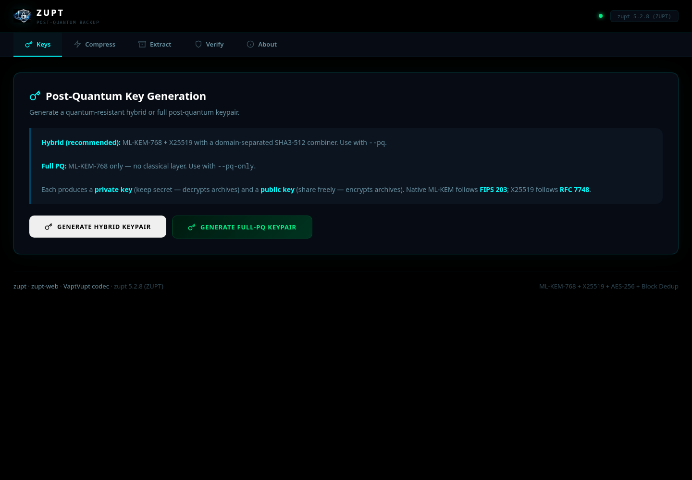
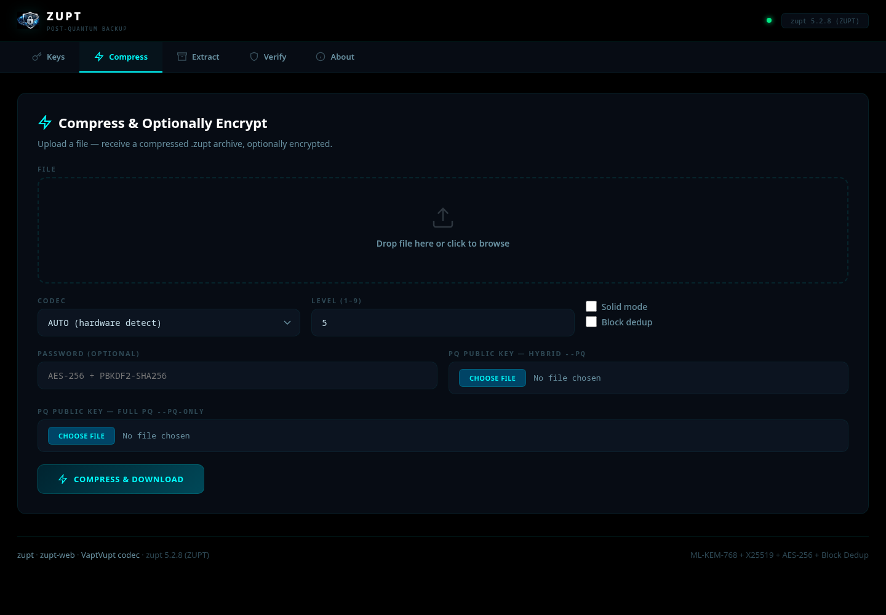
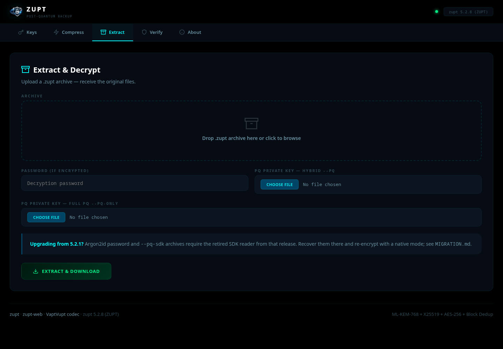
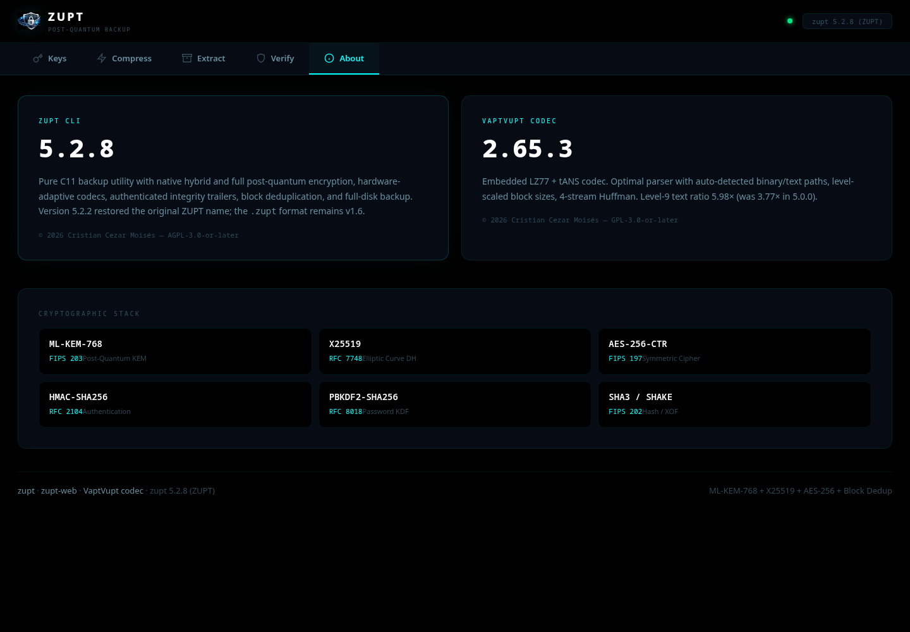

# ZUPT Web — Post-Quantum Backup in Your Browser

ZUPT Web is a self-hosted browser frontend for the ZUPT backup archiver. It
compresses, encrypts, verifies, inspects, and extracts `.zupt` archives without
accounts or cloud storage.

This release bundles the immutable **ZUPT 5.2.8** source release with the
**VaptVupt 2.65.3** compression codec. ZUPT 5.2.2 restored the product's
original name after releases 3.0.0–5.2.1 used VaptVupt; the archive extension
and format v1.6 did not change.

```bash
docker compose up -d --build
# http://localhost:8181
```

## Important upgrade note

The official ZUPT 5.2.8 source-only profile deliberately excludes the opaque
`libvuptsdk` binary used by the old web image. Consequently:

- native password, hybrid `--pq`, and full-PQ `--pq-only` workflows are
  available;
- new password archives use PBKDF2-SHA256 rather than Argon2id;
- Argon2id password archives and `--pq-sdk` archives created by the 5.2.1 web
  image need that release's compatibility reader.

Do not delete your 5.2.1 recovery environment until those archives have been
restored and re-encrypted with a native mode. See [MIGRATION.md](MIGRATION.md)
for a safe procedure. ZUPT 5.2.8 can read native `--pq` and `--pq-only`
archives and keys created by 5.2.1; the reverse direction is not guaranteed.

## Features

| Feature | Implementation |
|---|---|
| Hybrid post-quantum encryption | ML-KEM-768 + X25519 via `--pq` |
| Full post-quantum encryption | ML-KEM-768 via `--pq-only` |
| Password encryption | AES-256-CTR + HMAC-SHA256; PBKDF2-SHA256 |
| Compression | AUTO, VaptVupt 2.65.3, LZHP, or Store |
| Archive safety | Authenticated integrity trailer, per-block validation, hardened extraction |
| Backup options | Levels 1–9, solid mode, or block deduplication |
| Metadata inspection | Format/trailer, UUID, flags, encryption metadata, sizes, block count |
| Deployment | Three-stage, non-root, read-only Docker container |

Solid mode and block deduplication are intentionally mutually exclusive in the
web UI because the upstream solid writer does not perform actual deduplication.

## Deploy

Requirements: Docker Engine and Docker Compose.

```bash
git clone https://git.securityops.co/cristiancmoises/zupt-web.git
cd zupt-web
./setup.sh
```

`setup.sh` validates Compose, builds the image (including the bundled CLI test
gate), starts it, and waits for an exact health response. To use another host
port:

```bash
PORT_HOST=8282 ./setup.sh
```

The default bind is loopback-only because the UI accepts passwords and private
keys. Put it behind an authenticated HTTPS reverse proxy for remote access.
Set `BIND_HOST=0.0.0.0` only on a trusted LAN or when that TLS/authentication
boundary is already in place.

Manual deployment:

```bash
docker compose build
docker compose up -d
docker compose ps
```

## Configuration

`ZUPT_*` variables are canonical. The corresponding `VAPTVUPT_*` names remain
accepted as compatibility fallbacks for renamed-era deployments.

| Variable | Default | Purpose |
|---|---:|---|
| `ZUPT_MAX_UPLOAD_MB` | `512` | Maximum request size in MiB |
| `ZUPT_KEY_TTL_SEC` | `14400` | Job/key retention time |
| `ZUPT_SECRET_KEY` | generated at container start | Flask secret |
| `ZUPT_COMPRESS_TIMEOUT` | `600` | Compression timeout in seconds (1–600) |
| `ZUPT_EXTRACT_TIMEOUT` | `600` | Extraction/verify timeout in seconds (1–600) |

Example:

```bash
ZUPT_MAX_UPLOAD_MB=512 ZUPT_KEY_TTL_SEC=1800 docker compose up -d
```

The supported Compose deployment fixes the CLI at `/usr/local/bin/zupt` and
the ephemeral work directory at `/tmp/zupt-work` so it stays aligned with the
read-only filesystem and 2 GiB tmpfs. Custom launchers may use `ZUPT_BIN` and
`ZUPT_WORKDIR` directly. Compose also maps the corresponding renamed-era
`VAPTVUPT_*` settings when a canonical value is absent.

## Verify a deployment

```bash
curl -fsS http://localhost:8181/healthz
# {"ok":true,"service":"zupt-web","version":"5.2.8"}

curl -fsS http://localhost:8181/version  # CLI readiness; 503 when unavailable
docker exec zupt-web zupt version
docker inspect --format '{{.Config.User}} {{.HostConfig.ReadonlyRootfs}}' zupt-web
```

The canonical executable is `/usr/local/bin/zupt`. A `vaptvupt -> zupt`
compatibility symlink is retained for scripts written against 3.0.0–5.2.1.

## Security posture

- Every bundled upstream file is checked against a manifest generated from the
  verified official ZUPT 5.2.8 release tarball before compilation; the asset's
  promoted SHA-256 is recorded in [UPSTREAM.md](UPSTREAM.md).
- The image builds ZUPT with `WITH_SDK=0 WITH_PQBOX=0`, so it contains no
  opaque SDK/PQBOX binaries and no private build-tree RPATH.
- Passwords cross the CLI boundary through inherited standard input with
  `--pass-fd 0`; they never appear in process arguments.
- Every form uses a constant-time-checked double-submit CSRF token.
- Uploaded paths are isolated per job and output paths are checked before
  download or tar creation.
- Flask sets CSP, clickjacking, MIME-sniffing, referrer, opener/resource, and
  permissions headers. No third-party font or script request is made.
- The runtime uses uid 1001, drops every Linux capability, enables
  `no-new-privileges`, limits PIDs/memory, and has a read-only root filesystem.
- The final stage contains the minimal Ubuntu runtime packages, tini, the
  hash-locked application environment, and the audited ZUPT binary.
  pip/setuptools/wheel and compiler tools do not enter the runtime.

This is defense in depth, not a claim that browser uploads are risk-free. Never
send credentials to it over untrusted plain HTTP; keep the service private or
place it behind an authenticated HTTPS reverse proxy.

## Architecture

```text
Browser
   │ HTTP :8181
   ▼
gunicorn (2 workers, uid 1001)
   │
   ▼
Flask application ── explicit argv + inherited password FD ──▶ ZUPT 5.2.8
   │                                                         (source-only)
   ▼
tmpfs /tmp/zupt-work ── expiring job directories ──▶ streamed download
```

The app enforces a maximum operation timeout of 600 seconds; gunicorn waits
660 seconds so Flask can return a controlled timeout page instead of losing
the worker at the same instant.

## Development and audit

Install the hash-locked Python environment, then run the web tests:

```bash
python3 -m venv .venv
.venv/bin/pip install --require-hashes -r requirements.txt
.venv/bin/python -m unittest discover -s tests -v
```

Exercise the bundled CLI directly:

```bash
cd zupt-5.2.8
bash scripts/check-source-only.sh --tree .
make clean
make -j"$(getconf _NPROCESSORS_ONLN 2>/dev/null || printf 1)" \
  WITH_SDK=0 WITH_PQBOX=0 V=1
make WITH_SDK=0 WITH_PQBOX=0 check
make WITH_SDK=0 WITH_PQBOX=0 test-all
make sdk-test
make test-asan-run
```

The official release tar intentionally omits three packaging recipes that are
present only in the Git checkout, so its `release-check` aggregate is not the
appropriate embedded-source command. The equivalent applicable gates and all
release evidence are recorded in [AUDIT.md](AUDIT.md).

## Screenshots

<p align="center">
  <br><br>
  <br><br>
  <br><br>
  
</p>

## Project links

- [ZUPT](https://github.com/cristiancmoises/zupt) — CLI/GUI and bundled source
- [zupt-web on git.securityops.co](https://git.securityops.co/cristiancmoises/zupt-web)
- [GitHub mirror](https://github.com/cristiancmoises/zupt-web)
- [Codeberg mirror](https://codeberg.org/berkeley/zupt-web)
- [VaptVupt codec](https://git.securityops.co/cristiancmoises/vaptvupt-codec)

## License

ZUPT Web is AGPL-3.0-or-later. The bundled ZUPT source contains separately
identified AGPL-3.0-or-later, GPL-3.0-or-later, BSD-2-Clause,
BSD-3-Clause, and CC0-1.0 scopes. Preserve the complete `LICENSE*`, `NOTICE`,
and `THIRD-PARTY-NOTICES.md` payload when redistributing the image or source.
See [LICENSE](LICENSE) and `zupt-5.2.8/THIRD-PARTY-NOTICES.md`.

Commercial licensing inquiries: `sac@securityops.co`.
